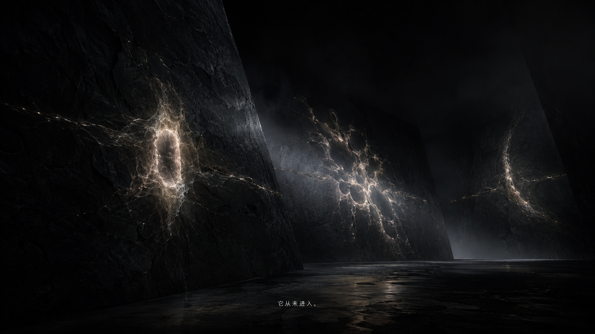
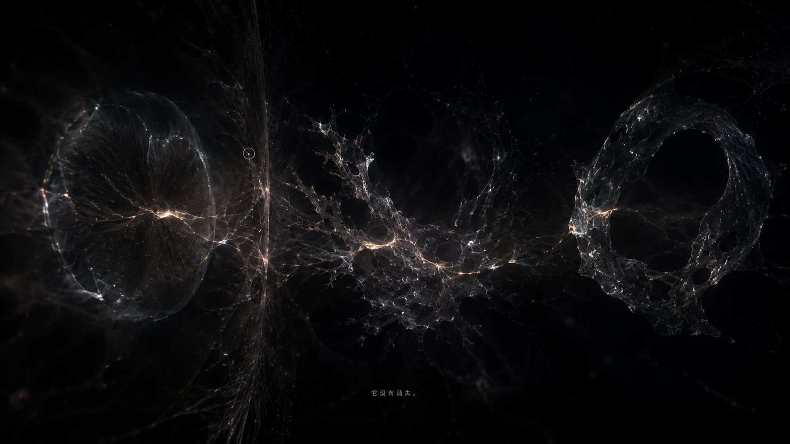
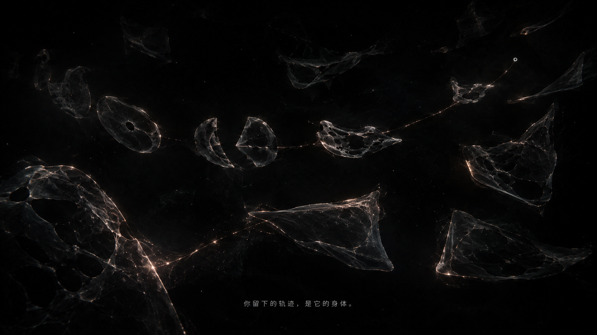
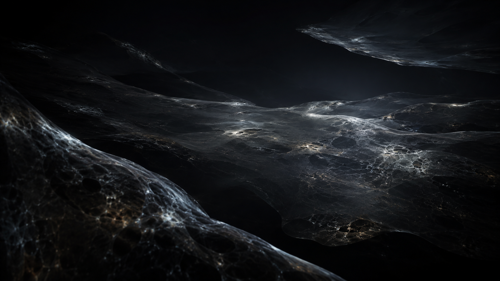
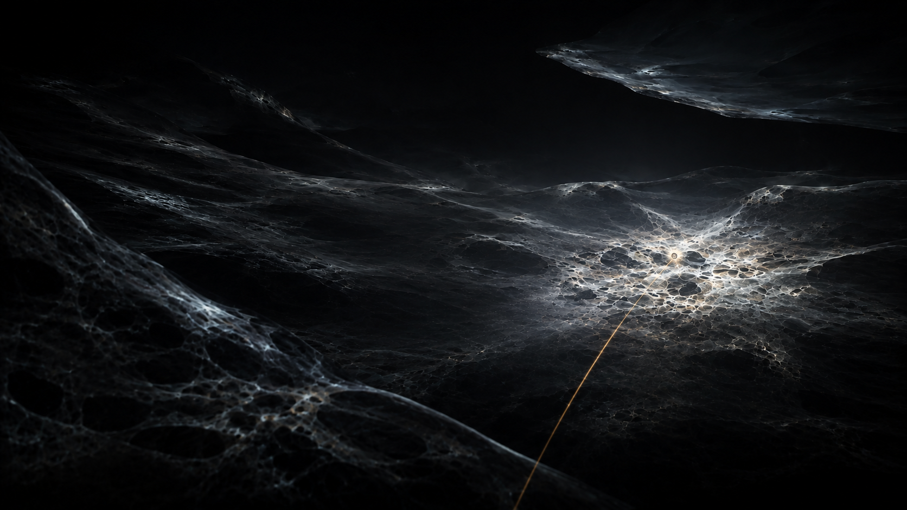
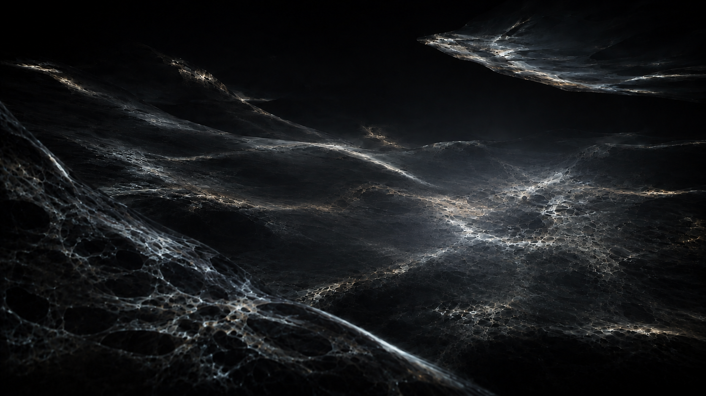
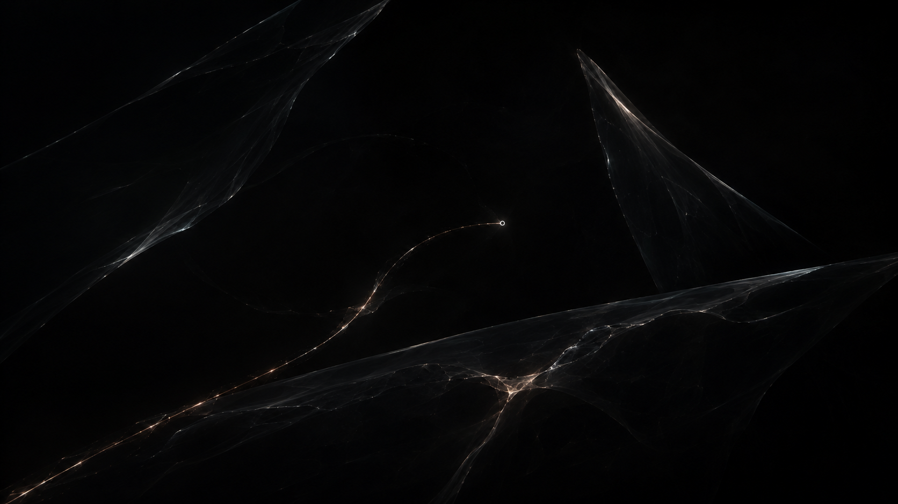
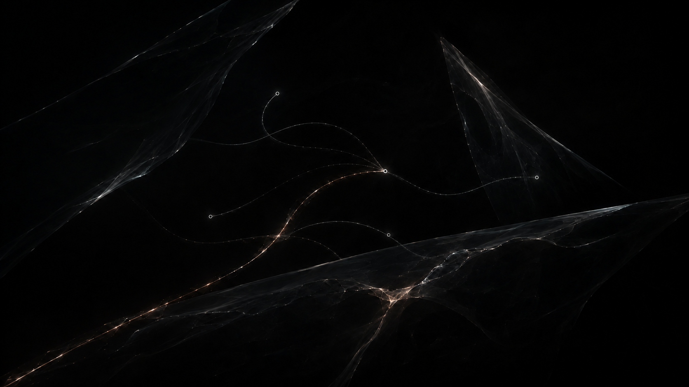
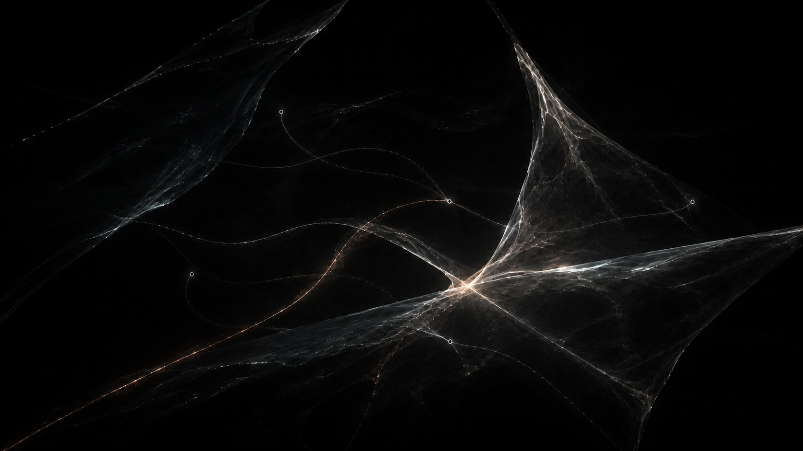

# 世界架构视觉锚点

这组素材是 HUMAN UNKNOWN 三个世界的**交互状态锚点**，用于统一实时实现的构图、材质与因果变化。它们不是九张待播放的影片帧，也不应直接替代运行时交互。

生成工具：OpenAI 内置 ImageGen  
画幅：1672 × 941，16:9  
生成日期：2026-09-05  
共同约束：近黑负空间、黑玻璃 / 云母 / 矿物膜、银白衍射、少量暖铜；无文字、HUD、卡片、人物、圆形传送门、故障风、霓虹赛博朋克或眼睛意象。

---

## 1. 截面之外

### 01 封闭空间异常

- **交互含义**：多个腔体看似封闭，同一存在的截面却在边界两侧连续出现。
- **生成提示摘要**：在近黑空间构成透明黑玻璃腔体；让银白有机截面出现在彼此无通道的空间中，以材质连续相位而非破墙证明“不可能穿越”。

### 02 生物断层与连续脉冲

- **交互含义**：形态不同的断面共享同一脉冲，提示它们属于一个更完整存在。
- **生成提示摘要**：沿同一视觉轴显示分离的生物断层；用贯穿多个断面的压力相位与银白衍射保持身份连续，不画解释线。

### 03 玩家轨迹显露身体

- **交互含义**：用户轨迹成为新截面，多个局部在轨迹上短暂显露同一身体。
- **生成提示摘要**：保留黑玻璃腔体与断面；加入一条克制的暖银玩家轨迹，让轨迹与多个截面交叉后显出无法被单一视角容纳的连续身体暗示。

---

## 2. 交换场

### 01 自主交换场

- **交互含义**：没有玩家时，网络已经在整体尺度上交换；环境本身就是文明。
- **生成提示摘要**：连续透明矿物膜与层架占据黑暗体积，宽压力前沿跨层重新分配，没有中心节点、角色、光标或界面。

### 02 玩家注入与远端失衡

- **交互含义**：中心偏右的局部注入变亮，同时远端左下薄化、降温、出现孔隙。
- **生成提示摘要**：保持相同镜头与膜网络；加入细小暖铜轨迹和接触点，使局部过度富集与远端代价由同一压力关系连接。

### 03 整体重平衡与文明回应

- **交互含义**：玩家撤回局部中心性后，整个网络以宽前沿自主重组并回应。
- **生成提示摘要**：移除光标与注入线；让过亮点回落，以跨越所有膜层的连贯重分配波恢复整体连通性，不使用胜利符号。

---

## 3. 仍在发生

### 01 唯一现实表象

- **交互含义**：当前暖银路径看似唯一，膜中只留下几乎未点亮的其他可能压痕。
- **生成提示摘要**：在无地平线黑暗体积中布置黑玻璃概率膜；只显示一条暖铜银路径和小型圆点探针，其他可能性只作为材料应力存在。

### 02 多条现实显现

- **交互含义**：四条冷银遗留路径从不同深度显现，与当前现实共处同一个连续空间。
- **生成提示摘要**：保持相同镜头、膜层和当前暖路径；让旧路径在膜前后遮挡、消失和重现，不用分屏、时间树或 glitch 表现平行现实。

### 03 遗留现实共同完成

- **交互含义**：当前路径独自无法展开结构，一条来自不同深度的旧路径返回，在互补交点共同显露跨膜连续表面。
- **生成提示摘要**：精确延续上一状态；暖路径的压力前沿停滞，冷银旧路径从深处弯回并与其对齐。两者形成大尺度连续接缝，但不能像传送门、奖杯、爆炸或结算动画。

---

## 4. 运行时使用规则

- 构图和材质可以引用锚点，关键运动必须由代码根据真实输入生成。
- 每张图对应一个语义状态，不对应固定播放时刻。
- 状态之间不做简单交叉淡化；必须表现“用户输入造成局部变化，局部变化传播为世界回应”。
- 原图可作为 WebGL 初始化 / 上下文恢复的低对比占位，但占位期间不能假装交互已经发生。
- 新素材只有在灰盒证明具体槽位后再生成；避免提前制造大量无法参与因果的装饰图。

完整状态条件、声音映射和科学边界见：`01-AI做的文档/10-多世界事件驱动交互与声音圣经.md`。
